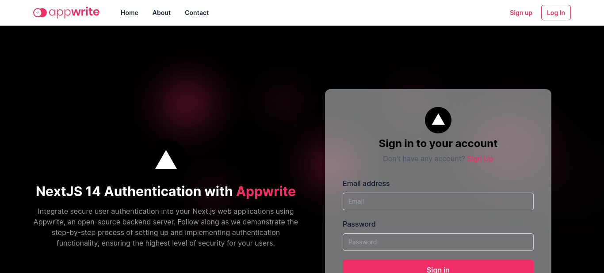

<!-- Nextjs-appwrite auth -->

<br />
    <a href="https://youtu.be/ZBCUegTZF7M?si=ubt0vk70lSjt6DCs" target="_blank">
      
    </a>
  <br />

  <div align="center">
    
    
    
    
  </div>

  # NEXTJS-APPWRITE AUTH

  A simple web application that utilizes next.js for the front-end and appwrite for the backend.

  ## 🛠 Built With <a name="built-with"></a>


<div align="start">
  <details>
  <summary>Client</summary>
  <ul>
    <li><a href="https://reactjs.org/">React.js</a></li>
    <li><a href="https://nextjs.org/">Next.js</a></li>
    <li><a href="https://tailwindcss.com/">Tailwindcss</a></li>
  </ul>
</details>
<details>
  <summary>Server</summary>
  <ul>
    <li><a href="https://appwrite.io/">Appwrite</a></li>
  </ul>
</details>
</div>

### Key Features <a name="key-features"></a>

> Basically the only feature available now.

- **Nextjs integrated with appwrite auth feature**
- **Persist user data from appwrite when logged in**

This is a [Next.js](https://nextjs.org/) project bootstrapped with [`create-next-app`](https://github.com/vercel/next.js/tree/canary/packages/create-next-app).


## 💻 Getting Started <a name="getting-started"></a>

> Please Fork or Clone this repo.

Follow these steps to set up the project locally on your machine.

### Prerequisites

Make sure you have the following installed on your machine:

- [Git](https://git-scm.com/)
- [Node.js](https://nodejs.org/en)
  - ``` node -v```
- [npm](https://www.npmjs.com/) (Node Package Manager)
  - ```npm -v ```

### Setup

Clone this repository to your desired folder:

```bash
  git clone git@github.com:s-kvng/nextjs-appwrite.git
  cd <my-project> or cd nextjs-appwrite
```

### Install Dependencies <a name="install-dependencies">

Install the project dependencies with:

```bash
  cd <my-project> or cd nextjs-appwrite
  npm install
```
Then, run the development server:

```bash
npm run dev
```

Open [http://localhost:3000](http://localhost:3000) with your browser to see the result.

You can start editing the page by modifying `app/page.tsx`. The page auto-updates as you edit the file.

This project uses [`next/font`](https://nextjs.org/docs/basic-features/font-optimization) to automatically optimize and load Inter, a custom Google Font.

## Learn More

To learn more about Next.js and appwrite, take a look at the following resources:

- [Next.js Documentation](https://nextjs.org/docs) - learn about Next.js features and API.
- [Learn Next.js](https://nextjs.org/learn) - an interactive Next.js tutorial.
- [Learn Appwrite](https://appwrite.io/docs) - a backend as a service.


## Deploy on Vercel

The easiest way to deploy your Next.js app is to use the [Vercel Platform](https://vercel.com/new?utm_medium=default-template&filter=next.js&utm_source=create-next-app&utm_campaign=create-next-app-readme) from the creators of Next.js.

Check out our [Next.js deployment documentation](https://nextjs.org/docs/deployment) for more details.

<!-- AUTHORS -->

## 👥 Authors <a name="authors"></a>

> This is the awesome team that built this project.

👤 **Nathaniel E. Adama** 🧑🏻‍💻

- GitHub: [@s-kvng](https://github.com/s-kvng)
- Twitter: [@sirr_nathan](https://twitter.com/sirr_nathan)
- LinkedIn: [Nathaniel E. Adama](https://www.linkedin.com/in/nathaniel-e-adama-93802a234/)

## 🤝 Contributing <a name="contributing"></a>

Contributions, issues, and feature requests are welcome!

Feel free to check the [issues page](../../issues/).

## Acknowledgments

- [Hitesh Choudhary](https://www.youtube.com/@HiteshChoudharydotcom)


## 📝 License

This project is [MIT](./LICENSE) licensed.
